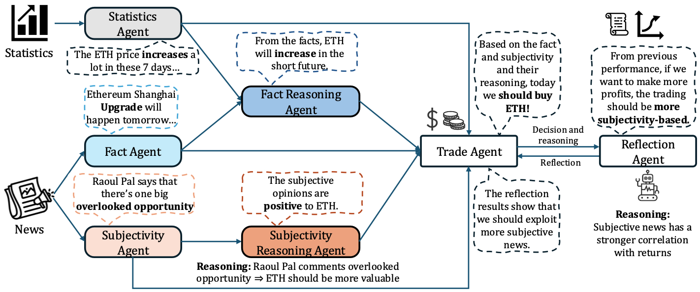

# FS-ReasoningAgent
While many studies prove more advanced LLMs perform better on tasks such as math and trading, we notice that in cryptocurrency trading, stronger LLMs work worse than weaker LLMs often. To study how this counter-intuitive phenomenon occurs, we examine the LLM reasoning processes on making trading decisions. We find that separating the reasoning process into factual and subjective components can lead to higher profits. Building on this insight, we introduce a multi-agent framework, FS-ReasoningAgent, which enables LLMs to recognize and learn from both factual and subjective reasoning. Then, we conduct extensive experiments showing that this framework improves LLMs' trading performance in the cryptocurrency. We encourage the research community to move beyond the assumption that stronger LLMs always deliver better performance. Instead, the focus should be on understanding the preferences and strengths of different LLMs to select the most suitable one for specific tasks. 

## Overview
<p align='center'>
  
</p>

## Requirements
We list main requirements of this repository below. 

- openai==1.30.5
- torch==2.3.0
- torch-cluster==1.6.1+pt20cu117
- torch-geometric==2.3.0
- torch-scatter==2.1.1+pt20cu117
- torch-sparse==0.6.17+pt20cu117
- torch-spline-conv==1.2.2+pt20cu117
- torchaudio==2.0.1+cu117
- torchmetrics==0.11.4
- torchvision==0.15.1+cu117
- transformers==4.30.2

## Running FS-ReasoningAgent
To run the FS-ReasoningAgent, you need to input your OpenAI API key and in the ```utils.py``` file. And then run the following command:
  ``` 
  bash run_agent.sh
  ```

## Example Output
We provide an example output of ETH in a bull market condition using o1-mini after running the ```run_agent.sh``` file.

  ```
  Namespace(dataset='eth', model='o1-mini', to_print=1, starting_date='2024-01-24', ending_date='2024-03-13', price_window=7, reflection_window=3, seed=6216, use_memory=False, use_tech=1, use_txnstat=1, use_news=1, use_reflection=1, resume_dir='', start_trial_num=0, num_trials=1, num_envs=1, run_name='eth_run', is_resume=False)

*** START STATE ***
{'cash': 500000.0, 'eth_held': 223.04004842160197, 'open': 2241.749872, 'net_worth': 1000000.0, 'roi': 0.0, 'today_roi': 0.0, 'technical': {}, 'txnstat': {'unique_addresses': 577757, 'total_transactions': 1083406, 'total_gas_used': 107559721243, 'average_gas_price': 18590570686.19659, 'successful_transactions': 1066607, 'total_value_transferred': '2696317006356067384684917'}, 'date': '2024-01-24T00:00:00.000Z'}
*** END STATE ***

********* START STEP 0 *********

*** START STATISTICAL AGENT ***
You are an eth cryptocurrency trading analyst. The recent price and auxiliary information is given in chronological order below:
"""
Open price: 2241.75, unique_addresses: 577757, total_transactions: 1083406, total_gas_used: 107559721243, average_gas_price: 18590570686.19659, successful_transactions: 1066607, total_value_transferred: 2696317006356067384684917

"""
Write one concise paragraph to analyze the recent information and estimate the statistical trend accordingly.
*** STATISTICAL AGENT RESPONSE ***
Analyzing the recent Ethereum data, the opening price of $2,241.75 is supported by robust network activity, evidenced by 577,757 unique addresses and over 1.08 million total transactions. The substantial total gas used at approximately 107.56 billion units, coupled with an average gas price of around 18.59 Gwei, indicates strong demand for transaction processing and network utilization. With a high success rate of nearly 98.2% for transactions and a significant total value transferred exceeding 2.696 × 10²¹ wei (approximately 2.696 million ETH), the metrics suggest increasing investor engagement and transactional volume. Statistically, these indicators point towards a bullish trend for Ethereum, underpinned by growing user activity and sustained demand, though attention should be paid to potential fluctuations in gas prices that could impact overall network dynamics.
*** END STATISTICAL AGENT ***


*** START FACTUAL NEWS AGENT ***
You are an eth cryptocurrency trading analyst. You are required to analyze only the factual news, not the subjective news such as someone's comments from following news articles:
"""
[{'id': 2, 'time': 'Tue, 23 Jan 2024 08:00:00 GMT', 'title': 'Donald Trump Sold $2.4 Million Ethereum: Smart Move Or Big Mistake? - Yahoo Finance', 'content': 'Former President Donald Trump has sold more than 1,000 Ether (ETH) in the past several weeks, according to blockchain analytics company Arkham Intelligence, which has been tracking his ETH holdings for the past several months. It obtained the data through Trump\'s financial filings and disclosures.\n\nMost of the ETH comes from royalties for non-fungible token (NFT) projects that Trump created. In December 2022, Trump released a set of 45,000 NFTs, each priced at $99. The project has amassed trading volumes of over $35 million or 15,000 ETH.\n\nThe NFTs are largely trading above their original price of $99. As of Jan. 19, the cheapest NFT is listed for over $600 and the highest sale was for 37 ETH.\n\nDon\'t Miss:\n\nIn early 2024, Trump announced another trading card NFT project that has some unique rewards for owners. Some of the potential perks could be dinner with the former president, or even a small piece of fabric from the suit he wore in his Georgia mugshot.\n\nHowever, Trump and his companies are not directly associated with these NFT projects. NFT International created and distributed the NFTs and uses Trump\'s "name, likeness and image under paid license from CIC Digital LLC, which license may be terminated or revoked according to its terms."\n\nTrump sold 1,075 ETH for over $2.4 million through Coinbase.. At its peak, it was worth more than $4 million.\n\nThe sale comes after a strong month for Ethereum. The price was up more than 17% in the month leading up to the sale, 30% in the six months before and 60% over the past year.\n\nEven though Trump said during his presidency that he was "not a fan" of Bitcoin and that crypto is a "disaster waiting to happen," it is hard to pass on several million dollars. Though Trump is largely unaffiliated with the project, he is still earning royalties. While his stance on crypto is still up in the air, the recent sale is an interesting development in Trump\'s relationship with crypto.\n\nAs the presidential race heats up, it will be important to watch for news relating to presidential candidates\' stances on crypto, as this could have large implications for prices, future adoption and use cases going forward.\n\nRead Next:\n\n"ACTIVE INVESTORS\' SECRET WEAPON" Supercharge Your Stock Market Game with the #1 "news & everything else" trading tool: Benzinga Pro - Click here to start Your 14-Day Trial Now!\n\nStory continues\n\nGet the latest stock analysis from Benzinga?\n\nThis article Donald Trump Sold $2.4 Million Ethereum: Smart Move Or Big Mistake? originally appeared on Benzinga.com\n\n© 2024 Benzinga.com. Benzinga does not provide investment advice. All rights reserved.'}, {'id': 8, 'time': 'Tue, 23 Jan 2024 08:00:00 GMT', 'title': 'Ethereum, Solana Losses Pile Up as Bitcoin Sell-Off Sinks Crypto Market - Decrypt', 'content': "Decrypt’s Art, Fashion, and Entertainment Hub. Discover SCENE\n\nBitcoin (BTC) and the wider crypto market are down bad this week. But some of the biggest losers near the top of the market were once recently stars of the show, including Ethereum (ETH), Solana (SOL), and Avalanche (AVAX).\n\nIn recent weeks, all three of those top 20 cryptocurrencies were making big gains as they attracted institutional investor interest. Now, each has slipped by at least 14% over the past seven days, and have posted sizable losses on the day.\n\nEthereum is down sharply this morning, per data from CoinGecko, falling 7% over the past 24 hours to a current price of about $2,200 and pushing its seven-day dip to 14%.\n\nSolana is down almost 16% over the past seven days at a current price of $82.50. It has rebounded slightly from earlier this morning, but remains down about 5% on the day.\n\nAD\n\nAD\n\nMeanwhile AVAX, which is the 11th largest cryptocurrency, has plunged 19% on the week to a current price of just under $29. Like Solana, it has shored up some of its losses since this morning, now down about 5% over the past 24 hours.\n\nIt was just over a week ago that Ethereum came just shy of hitting $2,700, its highest price since April 2022. Excitement over Ethereum grew amid the launch of spot Bitcoin ETFs as investors considered the next wave of prospective institutional adoption, particularly as BlackRock CEO Larry Fink talked up the prospect of an Ethereum spot ETF.\n\nSOL had been on a big run starting from the end of October. It was expected to take a hit during the trial of disgraced crypto mogul Sam Bankman-Fried, who was heavily invested in the asset via his now collapsed crypto empire, FTX.\n\nBut major companies such as Visa and Shopify sung the project's praises and said they'd use its blockchain. A growing developer base also meant the price of SOL shot up. It rose as high as $123 in December 2023, nearing a two-year high after plunging to a price of about $8 in December 2022.\n\nAD\n\nAD\n\nAVAX also attracted interest when investment banking giant J.P. Morgan said in November it had used the Avalanche blockchain to tokenize portfolios.\n\nLong-term holders have reason to be optimistic, though—despite the recent dips in price, both coins over a one-year period are doing well: SOL is up 239%, while AVAX has jumped by 64%. Even Ethereum is up by 35% over the last year.\n\nThe broader crypto market has taken a nosedive as it follows the price action of the biggest digital asset by market cap, Bitcoin.\n\nSince crypto fund Grayscale converted its flagship BTC fund into an exchange-traded fund (ETF) and started trading on the stock market, investors have been keen to redeem shares previously locked into the product.\n\nThis has put pressure on the price of the biggest and oldest digital coin in recent days.\n\nEdited by Andrew Hayward\n\nDisclaimer The views and opinions expressed by the author are for informational purposes only and do not constitute financial, investment, or other advice."}, {'id': 11, 'time': 'Tue, 23 Jan 2024 08:00:00 GMT', 'title': 'Polymer Labs secures $23M to bring IBC to Ethereum - Blockworks', 'content': 'Polymer Labs, a modular IBC-based networking protocol, has secured a $23 million Series A co-led by Blockchain Capital, Maven 11 and Distributed Global.\n\nOther investors, including Coinbase Ventures, Placeholder, Digital Currency Group, North Island Ventures and Figment Capital also participated in the round.\n\nPolymer can be described as a modular layer-2 network that employs Cosmos SDK’s IBC protocol, OP stack’s settlement functionality and Eigenlayer’s data availability layer. It is the brainchild of Bo Du and Peter Kim.\n\nAfter being in the blockchain industry for a few years, the Polymer founders experienced firsthand how difficult it was to build interchain products. In the summer of 2021, they made a decision to drop their side projects and focus on fixing blockchain interoperability.\n\nRead more: The Interchain Foundation puts aside $26.4M to grow Cosmos ecosystem\n\nInitially, the team wanted to design their own interoperability protocol — similar to that of many general message-passing protocols that exist today. However, during their research, they came across the Cosmos SDK’s Inter-Blockchain Communication protocol, Du told Blockworks.\n\nIBC is an inter-blockchain communication protocol, as its name suggests. It allows different blockchains in the Cosmos ecosystem to communicate with each other. The protocol is designed to ensure that information can be securely transferred between separate operating chains.\n\nRead More: DeFi users ‘don’t care’ what chain apps are on\n\n“IBC already had years put into its design and architecture, so we decided to stick with IBC and not invent a whole new standard,” Du said.\n\nKim added that at the time, IBC was the most decentralized, elegant solution to establish connections and pass messages between chains.\n\n“\u200b\u200bWe realized this was something that could be expanded to other chains; basically export the technology to have industry penetration rather than just the Cosmos app chains,” Kim said.\n\nSo how does it work?\n\nThe team wanted to find ways to make the already established interoperability protocol on Cosmos a mainstream standard in the Ethereum ecosystem.\n\n“It’s not easy to integrate IBC natively into all these different chains, which is why we designed the virtual IBC protocol, which essentially allows chains that don’t natively implement IBC to access IBC execution through Polymer and have Polymer execute IBC on its behalf,” Du said.\n\nMany blockchain interoperability protocols today are focused on the state component of interoperability, which involves aligning the status of the data stored within separate systems, but Du believes this is just one part of the interoperability problem.\n\nRead more: Interoperability isn’t just a buzzword\n\nBeyond the state layer, two other layers need to be considered. This includes the application layer — that is, the layer responsible for encoding and decoding sent data and the transportation layer (TAO) — which manages the routing of raw data.\n\n“All of IBC’s core logic will live on the transportation layer; this becomes decoupled from the application layer, and Polymer will hold the IBC state on behalf of the connected chain,” Du said.\n\nThis means that at the end of the day, the application — which lives on Ethereum — will be able to interact with the IBC network through Polymer smart contracts.\n\n“Polymer will then take the apps intended actions and execute the associated IBC logic and produce a commitment to the IBC state of that chain on Polymer — so essentially, Polymer is maintaining this merkle-ized IBC state on behalf of the connected chain,” he said.\n\nRead more: 2023’s top 5 DeFi protocols by revenue\n\nSimilar work to decouple state, application and transport layers is being explored by the interoperability protocol LayerZero.\n\nIBC has been around for a long period of time. Du notes that its specs cover various considerations ranging from authentication, timeouts and acknowledgment, somethings its competitors may not have.\n\nThis means that applications will not have to individually implement these different changes when there are protocol upgrades.\n\n“If you want to design a protocol that is going to last for generations of builders, you need to be able to handle these different edge cases properly,” Du said. “This is a foundational level protocol.”\n\nInvestors in Polymer Labs, Yuan Han Li and Joshua Rivera from Blockchain Capital, shared this sentiment.\n\nThey note in a press release reviewed by Blockworks that “while numerous arbitrary messaging protocols have emerged to address the cross-chain interoperability, they have all done so by building a new messaging standard, paradoxically causing more fragmentation when a standardized and battle tested way to move data between heterogeneous blockchains already exists.”\n\nUltimately, the Polymer team is hoping to ensure that IBC becomes a widely adopted interoperability standard that will shape how blockchain applications of the future will communicate. This latest funding round will b...'}]
"""
Write one concise paragraph to analyze and summarize the factual news and estimate the market trend accordingly.
*** FACTUAL NEWS AGENT RESPONSE ***
Recent developments in the Ethereum market present a mixed outlook for investors. Former President Donald Trump has sold over 1,000 ETH, amounting to approximately $2.4 million, during a period when Ethereum had previously seen significant gains, including a 17% increase in the month leading up to the sale. Despite these individual transactions, the broader crypto market is currently under pressure due to a Bitcoin sell-off, causing Ethereum to decline by 14% over the past week alongside other major cryptocurrencies like Solana and AVAX. On a positive front, Polymer Labs has secured $23 million in Series A funding to implement the Inter-Blockchain Communication (IBC) protocol on Ethereum, aiming to enhance blockchain interoperability and potentially drive future growth. Overall, while short-term market sentiment appears bearish due to macroeconomic factors, ongoing technological advancements and funding initiatives like Polymer Labs’ efforts may support Ethereum’s long-term prospects.
*** END FACTUAL NEWS AGENT ***


*** START FACTUAL REASONING AGENT ***
You are an eth cryptocurrency trading analyst. Based on the following factual news analysis and onchain analysis, provide your reasoning for the trading suggestions. This reasoning will be used for the final trading action.

Factual News Analysis:
Recent developments in the Ethereum market present a mixed outlook for investors. Former President Donald Trump has sold over 1,000 ETH, amounting to approximately $2.4 million, during a period when Ethereum had previously seen significant gains, including a 17% increase in the month leading up to the sale. Despite these individual transactions, the broader crypto market is currently under pressure due to a Bitcoin sell-off, causing Ethereum to decline by 14% over the past week alongside other major cryptocurrencies like Solana and AVAX. On a positive front, Polymer Labs has secured $23 million in Series A funding to implement the Inter-Blockchain Communication (IBC) protocol on Ethereum, aiming to enhance blockchain interoperability and potentially drive future growth. Overall, while short-term market sentiment appears bearish due to macroeconomic factors, ongoing technological advancements and funding initiatives like Polymer Labs’ efforts may support Ethereum’s long-term prospects.Onchain Analysis:
Analyzing the recent Ethereum data, the opening price of $2,241.75 is supported by robust network activity, evidenced by 577,757 unique addresses and over 1.08 million total transactions. The substantial total gas used at approximately 107.56 billion units, coupled with an average gas price of around 18.59 Gwei, indicates strong demand for transaction processing and network utilization. With a high success rate of nearly 98.2% for transactions and a significant total value transferred exceeding 2.696 × 10²¹ wei (approximately 2.696 million ETH), the metrics suggest increasing investor engagement and transactional volume. Statistically, these indicators point towards a bullish trend for Ethereum, underpinned by growing user activity and sustained demand, though attention should be paid to potential fluctuations in gas prices that could impact overall network dynamics.
*** FACTUAL REASONING AGENT RESPONSE ***
**Trading Recommendation: Hold with a Cautious Long Bias**

**Reasoning:**

**1. Short-Term Market Sentiment: Bearish Pressure**
- **Market-Wide Decline:** Ethereum has experienced a 14% decline over the past week, mirroring the broader cryptocurrency market's downturn driven by a Bitcoin sell-off. Given Bitcoin's dominant influence on the crypto market, continued weakness in BTC could exert downward pressure on ETH in the near term.
- **Significant ETH Sell-Off:** The sale of over 1,000 ETH by a high-profile individual, such as former President Donald Trump, totaling approximately $2.4 million, contributes to negative sentiment. Large transactions by prominent figures can signal diminished confidence, potentially spooking other investors.

**2. Positive Long-Term Indicators: Technological and Network Strength**
- **Technological Advancements:** Polymer Labs securing $23 million in Series A funding to implement the Inter-Blockchain Communication (IBC) protocol on Ethereum is a significant positive. Enhanced interoperability can drive broader adoption and integration with other blockchain ecosystems, potentially boosting Ethereum's utility and demand in the long run.
- **Robust On-Chain Metrics:**
  - **Network Activity:** With 577,757 unique addresses and over 1.08 million total transactions, Ethereum demonstrates strong and growing user engagement.
  - **High Gas Usage and Transaction Volume:** A total gas used of approximately 107.56 billion units and an average gas price of 18.59 Gwei indicate substantial demand for transaction processing, reflecting active network utilization.
  - **Transaction Success Rate and Value Transferred:** A high success rate of 98.2% and a total value transferred exceeding 2.696 × 10²¹ wei (approximately 2.696 million ETH) suggest reliable network performance and significant capital movement, underpinning investor confidence.
  
**3. Balancing Short-Term Risks and Long-Term Potential:**
- **Cautious Optimism:** While short-term indicators point to bearish sentiment influenced by macroeconomic factors and market-wide sell-offs, the underlying on-chain data and ongoing technological developments present a bullish case for Ethereum's future.
- **Potential for Recovery and Growth:** The strong network activity and successful transaction metrics imply resilience and sustained demand, which could facilitate a rebound once broader market conditions stabilize.

**Conclusion:**
Given the current bearish short-term market conditions influenced by Bitcoin's sell-off and notable ETH liquidation by key individuals, a cautious approach is advisable in the immediate term. However, the robust on-chain activity, high network utilization, and significant investments in technological advancements like the IBC protocol position Ethereum favorably for long-term growth. Therefore, holding existing ETH positions with a cautious long bias is recommended, allowing for participation in potential future appreciation while being mindful of short-term volatility.
*** END FACTUAL REASONING AGENT ***


*** START SUBJECTIVE NEWS AGENT ***
You are an eth cryptocurrency trading analyst. You are required to analyze only the subjective news such as someone's comments from following news articles:
"""
[{'id': 2, 'time': 'Tue, 23 Jan 2024 08:00:00 GMT', 'title': 'Donald Trump Sold $2.4 Million Ethereum: Smart Move Or Big Mistake? - Yahoo Finance', 'content': 'Former President Donald Trump has sold more than 1,000 Ether (ETH) in the past several weeks, according to blockchain analytics company Arkham Intelligence, which has been tracking his ETH holdings for the past several months. It obtained the data through Trump\'s financial filings and disclosures.\n\nMost of the ETH comes from royalties for non-fungible token (NFT) projects that Trump created. In December 2022, Trump released a set of 45,000 NFTs, each priced at $99. The project has amassed trading volumes of over $35 million or 15,000 ETH.\n\nThe NFTs are largely trading above their original price of $99. As of Jan. 19, the cheapest NFT is listed for over $600 and the highest sale was for 37 ETH.\n\nDon\'t Miss:\n\nIn early 2024, Trump announced another trading card NFT project that has some unique rewards for owners. Some of the potential perks could be dinner with the former president, or even a small piece of fabric from the suit he wore in his Georgia mugshot.\n\nHowever, Trump and his companies are not directly associated with these NFT projects. NFT International created and distributed the NFTs and uses Trump\'s "name, likeness and image under paid license from CIC Digital LLC, which license may be terminated or revoked according to its terms."\n\nTrump sold 1,075 ETH for over $2.4 million through Coinbase.. At its peak, it was worth more than $4 million.\n\nThe sale comes after a strong month for Ethereum. The price was up more than 17% in the month leading up to the sale, 30% in the six months before and 60% over the past year.\n\nEven though Trump said during his presidency that he was "not a fan" of Bitcoin and that crypto is a "disaster waiting to happen," it is hard to pass on several million dollars. Though Trump is largely unaffiliated with the project, he is still earning royalties. While his stance on crypto is still up in the air, the recent sale is an interesting development in Trump\'s relationship with crypto.\n\nAs the presidential race heats up, it will be important to watch for news relating to presidential candidates\' stances on crypto, as this could have large implications for prices, future adoption and use cases going forward.\n\nRead Next:\n\n"ACTIVE INVESTORS\' SECRET WEAPON" Supercharge Your Stock Market Game with the #1 "news & everything else" trading tool: Benzinga Pro - Click here to start Your 14-Day Trial Now!\n\nStory continues\n\nGet the latest stock analysis from Benzinga?\n\nThis article Donald Trump Sold $2.4 Million Ethereum: Smart Move Or Big Mistake? originally appeared on Benzinga.com\n\n© 2024 Benzinga.com. Benzinga does not provide investment advice. All rights reserved.'}, {'id': 8, 'time': 'Tue, 23 Jan 2024 08:00:00 GMT', 'title': 'Ethereum, Solana Losses Pile Up as Bitcoin Sell-Off Sinks Crypto Market - Decrypt', 'content': "Decrypt’s Art, Fashion, and Entertainment Hub. Discover SCENE\n\nBitcoin (BTC) and the wider crypto market are down bad this week. But some of the biggest losers near the top of the market were once recently stars of the show, including Ethereum (ETH), Solana (SOL), and Avalanche (AVAX).\n\nIn recent weeks, all three of those top 20 cryptocurrencies were making big gains as they attracted institutional investor interest. Now, each has slipped by at least 14% over the past seven days, and have posted sizable losses on the day.\n\nEthereum is down sharply this morning, per data from CoinGecko, falling 7% over the past 24 hours to a current price of about $2,200 and pushing its seven-day dip to 14%.\n\nSolana is down almost 16% over the past seven days at a current price of $82.50. It has rebounded slightly from earlier this morning, but remains down about 5% on the day.\n\nAD\n\nAD\n\nMeanwhile AVAX, which is the 11th largest cryptocurrency, has plunged 19% on the week to a current price of just under $29. Like Solana, it has shored up some of its losses since this morning, now down about 5% over the past 24 hours.\n\nIt was just over a week ago that Ethereum came just shy of hitting $2,700, its highest price since April 2022. Excitement over Ethereum grew amid the launch of spot Bitcoin ETFs as investors considered the next wave of prospective institutional adoption, particularly as BlackRock CEO Larry Fink talked up the prospect of an Ethereum spot ETF.\n\nSOL had been on a big run starting from the end of October. It was expected to take a hit during the trial of disgraced crypto mogul Sam Bankman-Fried, who was heavily invested in the asset via his now collapsed crypto empire, FTX.\n\nBut major companies such as Visa and Shopify sung the project's praises and said they'd use its blockchain. A growing developer base also meant the price of SOL shot up. It rose as high as $123 in December 2023, nearing a two-year high after plunging to a price of about $8 in December 2022.\n\nAD\n\nAD\n\nAVAX also attracted interest when investment banking giant J.P. Morgan said in November it had used the Avalanche blockchain to tokenize portfolios.\n\nLong-term holders have reason to be optimistic, though—despite the recent dips in price, both coins over a one-year period are doing well: SOL is up 239%, while AVAX has jumped by 64%. Even Ethereum is up by 35% over the last year.\n\nThe broader crypto market has taken a nosedive as it follows the price action of the biggest digital asset by market cap, Bitcoin.\n\nSince crypto fund Grayscale converted its flagship BTC fund into an exchange-traded fund (ETF) and started trading on the stock market, investors have been keen to redeem shares previously locked into the product.\n\nThis has put pressure on the price of the biggest and oldest digital coin in recent days.\n\nEdited by Andrew Hayward\n\nDisclaimer The views and opinions expressed by the author are for informational purposes only and do not constitute financial, investment, or other advice."}, {'id': 11, 'time': 'Tue, 23 Jan 2024 08:00:00 GMT', 'title': 'Polymer Labs secures $23M to bring IBC to Ethereum - Blockworks', 'content': 'Polymer Labs, a modular IBC-based networking protocol, has secured a $23 million Series A co-led by Blockchain Capital, Maven 11 and Distributed Global.\n\nOther investors, including Coinbase Ventures, Placeholder, Digital Currency Group, North Island Ventures and Figment Capital also participated in the round.\n\nPolymer can be described as a modular layer-2 network that employs Cosmos SDK’s IBC protocol, OP stack’s settlement functionality and Eigenlayer’s data availability layer. It is the brainchild of Bo Du and Peter Kim.\n\nAfter being in the blockchain industry for a few years, the Polymer founders experienced firsthand how difficult it was to build interchain products. In the summer of 2021, they made a decision to drop their side projects and focus on fixing blockchain interoperability.\n\nRead more: The Interchain Foundation puts aside $26.4M to grow Cosmos ecosystem\n\nInitially, the team wanted to design their own interoperability protocol — similar to that of many general message-passing protocols that exist today. However, during their research, they came across the Cosmos SDK’s Inter-Blockchain Communication protocol, Du told Blockworks.\n\nIBC is an inter-blockchain communication protocol, as its name suggests. It allows different blockchains in the Cosmos ecosystem to communicate with each other. The protocol is designed to ensure that information can be securely transferred between separate operating chains.\n\nRead More: DeFi users ‘don’t care’ what chain apps are on\n\n“IBC already had years put into its design and architecture, so we decided to stick with IBC and not invent a whole new standard,” Du said.\n\nKim added that at the time, IBC was the most decentralized, elegant solution to establish connections and pass messages between chains.\n\n“\u200b\u200bWe realized this was something that could be expanded to other chains; basically export the technology to have industry penetration rather than just the Cosmos app chains,” Kim said.\n\nSo how does it work?\n\nThe team wanted to find ways to make the already established interoperability protocol on Cosmos a mainstream standard in the Ethereum ecosystem.\n\n“It’s not easy to integrate IBC natively into all these different chains, which is why we designed the virtual IBC protocol, which essentially allows chains that don’t natively implement IBC to access IBC execution through Polymer and have Polymer execute IBC on its behalf,” Du said.\n\nMany blockchain interoperability protocols today are focused on the state component of interoperability, which involves aligning the status of the data stored within separate systems, but Du believes this is just one part of the interoperability problem.\n\nRead more: Interoperability isn’t just a buzzword\n\nBeyond the state layer, two other layers need to be considered. This includes the application layer — that is, the layer responsible for encoding and decoding sent data and the transportation layer (TAO) — which manages the routing of raw data.\n\n“All of IBC’s core logic will live on the transportation layer; this becomes decoupled from the application layer, and Polymer will hold the IBC state on behalf of the connected chain,” Du said.\n\nThis means that at the end of the day, the application — which lives on Ethereum — will be able to interact with the IBC network through Polymer smart contracts.\n\n“Polymer will then take the apps intended actions and execute the associated IBC logic and produce a commitment to the IBC state of that chain on Polymer — so essentially, Polymer is maintaining this merkle-ized IBC state on behalf of the connected chain,” he said.\n\nRead more: 2023’s top 5 DeFi protocols by revenue\n\nSimilar work to decouple state, application and transport layers is being explored by the interoperability protocol LayerZero.\n\nIBC has been around for a long period of time. Du notes that its specs cover various considerations ranging from authentication, timeouts and acknowledgment, somethings its competitors may not have.\n\nThis means that applications will not have to individually implement these different changes when there are protocol upgrades.\n\n“If you want to design a protocol that is going to last for generations of builders, you need to be able to handle these different edge cases properly,” Du said. “This is a foundational level protocol.”\n\nInvestors in Polymer Labs, Yuan Han Li and Joshua Rivera from Blockchain Capital, shared this sentiment.\n\nThey note in a press release reviewed by Blockworks that “while numerous arbitrary messaging protocols have emerged to address the cross-chain interoperability, they have all done so by building a new messaging standard, paradoxically causing more fragmentation when a standardized and battle tested way to move data between heterogeneous blockchains already exists.”\n\nUltimately, the Polymer team is hoping to ensure that IBC becomes a widely adopted interoperability standard that will shape how blockchain applications of the future will communicate. This latest funding round will b...'}]
"""
Write one concise paragraph to analyze the subjective news and estimate the market trend accordingly.
*** SUBJECTIVE NEWS AGENT RESPONSE ***
Donald Trump’s recent sale of $2.4 million in Ethereum, combined with his critical remarks describing cryptocurrency as a "disaster waiting to happen," introduces a negative sentiment that could weigh on the Ethereum market. As a high-profile figure, Trump's actions and statements have the potential to influence investor confidence and public perception of crypto assets. This negative endorsement may lead to increased selling pressure and hesitation among investors, potentially contributing to a short-term bearish trend in the Ethereum market and possibly affecting broader cryptocurrency sentiment.
*** END SUBJECTIVE NEWS AGENT ***


*** START SUBJECTIVE REASONING AGENT ***
You are an eth cryptocurrency trading analyst. Based on the following subjective news summary and analysis, provide your reasoning for the trading suggestions. This reasoning will be used for the final trading action.

Subjective News Analysis:
Donald Trump’s recent sale of $2.4 million in Ethereum, combined with his critical remarks describing cryptocurrency as a "disaster waiting to happen," introduces a negative sentiment that could weigh on the Ethereum market. As a high-profile figure, Trump's actions and statements have the potential to influence investor confidence and public perception of crypto assets. This negative endorsement may lead to increased selling pressure and hesitation among investors, potentially contributing to a short-term bearish trend in the Ethereum market and possibly affecting broader cryptocurrency sentiment.
*** SUBJECTIVE REASONING AGENT RESPONSE ***
**Trading Analysis Reasoning:**

The recent news involving Donald Trump's sale of $2.4 million in Ethereum, coupled with his critical remarks labeling cryptocurrency as a "disaster waiting to happen," presents several factors that could influence Ethereum's (ETH) market dynamics. Here's a detailed reasoning to inform potential trading actions:

1. **Influence of High-Profile Figures:**
   - **Market Sentiment Impact:** As a former U.S. President, Donald Trump's statements carry significant weight and can sway public opinion and investor confidence. His negative portrayal of cryptocurrency may lead to decreased enthusiasm among retail and institutional investors.
   - **Perception of Legitimacy:** Criticism from a prominent figure can cast doubts on the legitimacy and future prospects of cryptocurrencies, potentially affecting long-term investment appetite.

2. **Selling Pressure Due to Asset Liquidation:**
   - **Increased Supply:** Trump's sale of $2.4 million in ETH adds liquidity to the market. If other holders perceive this as a signal to exit, it could amplify selling pressure.
   - **Short-Term Price Decline:** The influx of ETH from such large sales, especially from influential individuals, can temporarily depress prices due to the sudden increase in supply against existing demand.

3. **Investor Behavior and Herd Mentality:**
   - **Fear, Uncertainty, and Doubt (FUD):** Negative remarks can trigger FUD among investors, leading to panic selling or reluctance to enter new positions.
   - **Herd Following:** Investors often follow the actions of influential figures. Trump's sale may prompt others to mimic his behavior, exacerbating market downturns.

4. **Broader Cryptocurrency Market Impact:**
   - **Ripple Effect on Altcoins:** Ethereum is a major cryptocurrency; its decline can influence the broader crypto market, potentially dragging down other altcoins.
   - **Regulatory Scrutiny:** High-profile criticisms can reignite calls for stricter regulations, increasing uncertainty and affecting market stability.

5. **Technical Analysis Considerations:**
   - **Support and Resistance Levels:** A significant sell-off can test key support levels. If breached, it might signal further downward momentum.
   - **Volume Indicators:** Increased selling volume typically confirms bearish trends, suggesting sustained price declines.

6. **Historical Context:**
   - **Past Reactions to Negative News:** Historically, ETH has shown vulnerability to negative sentiment, often leading to short-term price corrections followed by recoveries once sentiment stabilizes.

**Trading Suggestions Based on Analysis:**

1. **Short-Term Bearish Positioning:**
   - **Sell or Short ETH:** Given the immediate negative sentiment and potential for increased selling pressure, initiating short positions or selling existing ETH holdings could capitalize on anticipated price declines.
   
2. **Risk Management Strategies:**
   - **Implement Stop-Loss Orders:** Protect against unexpected market reversals by setting stop-loss levels to minimize potential losses.
   - **Diversify Portfolio:** Reduce exposure to ETH by reallocating funds to less volatile assets or stablecoins to safeguard capital.

3. **Hedging:**
   - **Use Derivatives:** Engage in options or futures contracts to hedge against anticipated declines, providing a cushion against market volatility.

4. **Monitoring and Reassessment:**
   - **Stay Informed:** Continuously monitor market reactions, additional statements from influential figures, and broader economic indicators to adjust strategies promptly.
   - **Technical Indicators Watch:** Keep an eye on key technical levels and indicators to identify optimal entry and exit points.

5. **Long-Term Perspective:**
   - **Potential Buying Opportunity Post-Correction:** If the market overreacts and ETH's price significantly dips beyond fundamental valuations, it might present a long-term buying opportunity once negative sentiments subside.

**Conclusion:**

The combination of a prominent figure's asset liquidation and negative remarks can adversely affect Ethereum's market in the short term. Traders should consider bearish strategies, implement robust risk management, and remain vigilant for signs of market stabilization or overcorrection to optimize trading actions based on this analysis.
*** END SUBJECTIVE REASONING AGENT ***


*** START TRADE AGENT ***
You are an experienced eth cryptocurrency trader and you are trying to maximize your overall profit by trading eth. In each day, you must make an action to buy or sell eth. You are assisted by a few analysts below and need to decide the final action.

ON-CHAIN ANALYST REPORT:
"""
Analyzing the recent Ethereum data, the opening price of $2,241.75 is supported by robust network activity, evidenced by 577,757 unique addresses and over 1.08 million total transactions. The substantial total gas used at approximately 107.56 billion units, coupled with an average gas price of around 18.59 Gwei, indicates strong demand for transaction processing and network utilization. With a high success rate of nearly 98.2% for transactions and a significant total value transferred exceeding 2.696 × 10²¹ wei (approximately 2.696 million ETH), the metrics suggest increasing investor engagement and transactional volume. Statistically, these indicators point towards a bullish trend for Ethereum, underpinned by growing user activity and sustained demand, though attention should be paid to potential fluctuations in gas prices that could impact overall network dynamics.
"""

NEWS ANALYST REPORT:
"""
Recent developments in the Ethereum market present a mixed outlook for investors. Former President Donald Trump has sold over 1,000 ETH, amounting to approximately $2.4 million, during a period when Ethereum had previously seen significant gains, including a 17% increase in the month leading up to the sale. Despite these individual transactions, the broader crypto market is currently under pressure due to a Bitcoin sell-off, causing Ethereum to decline by 14% over the past week alongside other major cryptocurrencies like Solana and AVAX. On a positive front, Polymer Labs has secured $23 million in Series A funding to implement the Inter-Blockchain Communication (IBC) protocol on Ethereum, aiming to enhance blockchain interoperability and potentially drive future growth. Overall, while short-term market sentiment appears bearish due to macroeconomic factors, ongoing technological advancements and funding initiatives like Polymer Labs’ efforts may support Ethereum’s long-term prospects.
"""

REFLECTION ANALYST REPORT:
"""
Donald Trump’s recent sale of $2.4 million in Ethereum, combined with his critical remarks describing cryptocurrency as a "disaster waiting to happen," introduces a negative sentiment that could weigh on the Ethereum market. As a high-profile figure, Trump's actions and statements have the potential to influence investor confidence and public perception of crypto assets. This negative endorsement may lead to increased selling pressure and hesitation among investors, potentially contributing to a short-term bearish trend in the Ethereum market and possibly affecting broader cryptocurrency sentiment.
"""


Now, provide your response in the following format:

1. Reasoning: Briefly analyze the given reports, considering both factual and subjective elements. Pay attention to the reflection report's guidance on emphasizing factual or subjective reasoning.

2. Factual vs Subjective Weighting: If there's a conflict between factual and subjective information, explain which you favor and why. Assign weights to factual and subjective information (e.g., 0.7 factual, 0.3 subjective) that sum to 1. Justify your weighting based on the reflection report's recommendation to maximize returns.

3. Risk Management: Describe how you're managing risk in light of the current market conditions and the reflection report's insights.

4. Action: Indicate your trading action as a 1-decimal float in the range of [-1,1]. This should reflect your confidence in the market trend, your strategic decision to manage risk, and the balance between factual and subjective reasoning.

Ensure your response is concise yet comprehensive, addressing all the above points.

*** TRADE AGENT RESPONSE ***
1. **Reasoning:**
   The On-Chain Analyst Report highlights strong Ethereum fundamentals with robust network activity and increasing user engagement, suggesting a bullish outlook. Conversely, the News Analyst Report presents a mixed scenario: significant ETH sell-offs by a high-profile figure (Donald Trump) and a broader market decline due to Bitcoin's sell-off indicate short-term bearish pressure. However, positive developments like Polymer Labs securing funding for technological advancements offer long-term growth potential. The Reflection Analyst emphasizes the negative sentiment from Trump's actions, which could exacerbate short-term market hesitancy.

2. **Factual vs Subjective Weighting:**
   - **Factual Information:** 0.6
     - Strong on-chain metrics and technological advancements provide a solid foundation for Ethereum's potential.
   - **Subjective Information:** 0.4
     - Negative sentiment from influential figures and current market pressure cannot be ignored as they impact immediate investor behavior.
   
   *Justification:* Balancing robust on-chain data with the significant short-term sentiment risks ensures a nuanced approach aimed at maximizing returns while acknowledging potential headwinds.

3. **Risk Management:**
   Given the conflicting signals, I will employ a conservative position sizing strategy, limiting exposure to mitigate potential short-term declines. Additionally, I will set stop-loss orders to protect against unexpected market downturns influenced by negative sentiment. Diversifying holdings to include assets less affected by Ethereum-specific news may also help manage overall portfolio risk.

4. **Action:**
   **0.3**
*** END TRADE AGENT ***


*** START ACTUAL ACTION ***
0.3
*** END ACTUAL ACTION ***


*** START STATE ***
{'cash': 349396.70462768816, 'eth_held': 289.9520629480826, 'open': 2233.969871, 'net_worth': 997140.8772880001, 'roi': -0.0028591227119999507, 'today_roi': -0.0028591227119999507, 'technical': {}, 'txnstat': {'unique_addresses': 576510, 'total_transactions': 1080129, 'total_gas_used': 107890753868, 'average_gas_price': 15447411952.006325, 'successful_transactions': 1063317, 'total_value_transferred': '1277782745928967854788076'}, 'date': '2024-01-24T00:00:00.000Z'}
*** END STATE ***

*** START CURRENT RESULT ***
Total return: -0.29, sharpe ratio: -inf, daily return mean: -0.29, daily return std: 0.00
*** END CURRENT RESULT ***

  ```

## License
This dataset is under license CC BY-NC-SA.
